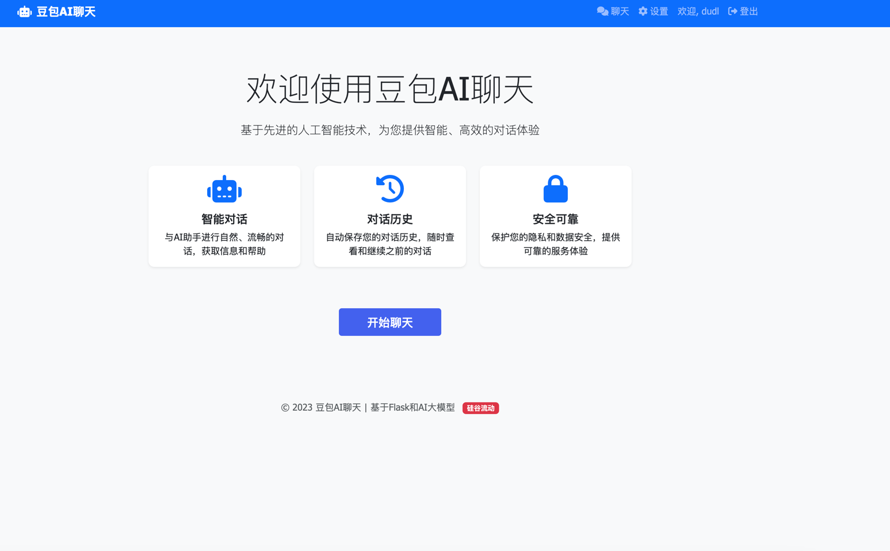
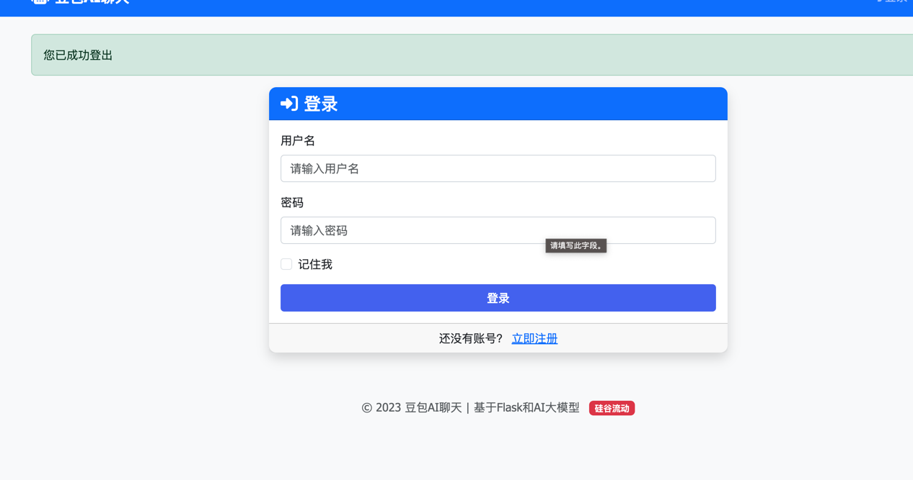
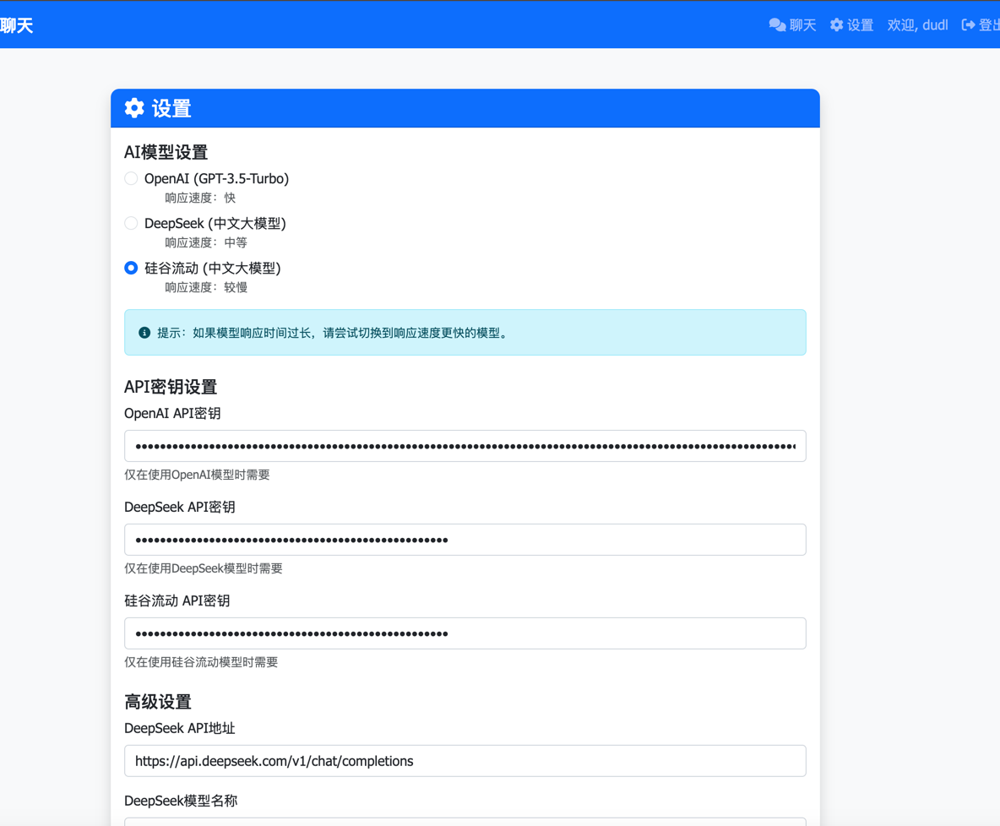
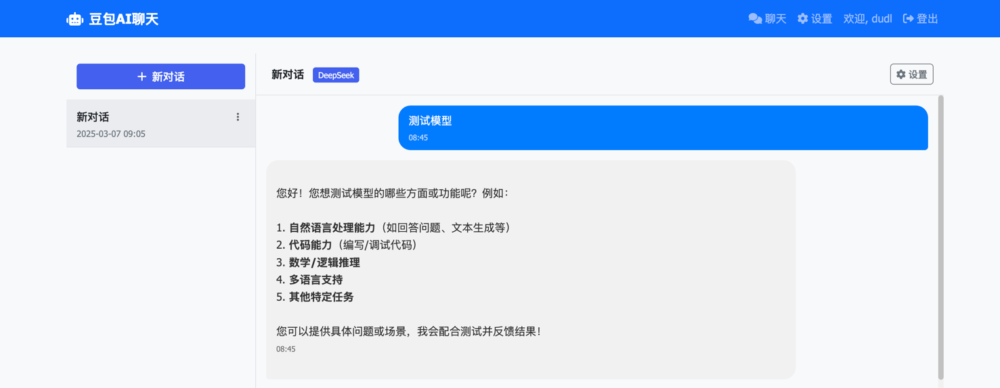

# Doubao Chat - AI Chat Application

一个基于Flask框架开发的AI聊天应用，灵感来自豆包AI。支持OpenAI和DeepSeek中文大模型。

## 功能特点

- 用户认证（注册、登录、登出）
- 与AI助手聊天（支持OpenAI和DeepSeek模型）
- 聊天历史存储
- 现代化响应式UI
- 模型切换功能

## 快速安装

### Linux/macOS用户:

```bash
# 克隆仓库
git clone https://github.com/dudl0428/doubao-chat.git
cd doubao-chat

# 运行安装脚本（自动使用清华大学镜像源）
chmod +x install.sh
./install.sh

# 编辑.env文件，设置您的SECRET_KEY和API密钥
nano .env  # 或使用其他编辑器

# 启动应用
./start.sh
```

### Windows用户:

```bash
# 克隆仓库
git clone https://github.com/yourusername/doubao-chat.git
cd doubao-chat

# 运行安装脚本（自动使用清华大学镜像源）
install.bat

# 编辑.env文件，设置您的SECRET_KEY和API密钥
notepad .env  # 或使用其他编辑器

# 启动应用
start.bat
```

## 详细安装步骤

1. 克隆仓库:
```bash
git clone https://github.com/yourusername/doubao-chat.git
cd doubao-chat
```

2. 创建并激活虚拟环境:
```bash
python -m venv venv
source venv/bin/activate  # Windows系统: venv\Scripts\activate
```

3. 安装依赖:

使用默认PyPI源:
```bash
pip install -r requirements.txt
```

使用国内镜像源(推荐):
```bash
# 使用清华大学镜像源
pip3 install -r requirements.txt -i https://pypi.tuna.tsinghua.edu.cn/simple

# 或使用阿里云镜像源
pip install -r requirements.txt -i https://mirrors.aliyun.com/pypi/simple/

# 或使用腾讯云镜像源
pip install -r requirements.txt -i https://mirrors.cloud.tencent.com/pypi/simple
```

4. 设置环境变量:
创建一个`.env`文件，内容如下:
```
FLASK_APP=run.py
FLASK_ENV=development
SECRET_KEY=your_secret_key_here

# 数据库配置
DATABASE_URL=sqlite:///app.db

# AI模型类型: 'openai' 或 'deepseek'
AI_MODEL_TYPE=deepseek

# OpenAI配置
OPENAI_API_KEY=your_openai_api_key_here

# DeepSeek配置
DEEPSEEK_API_KEY=your_deepseek_api_key_here
DEEPSEEK_API_URL=https://api.deepseek.com/v1/chat/completions
DEEPSEEK_MODEL=deepseek-chat
```

5. 初始化数据库:
```bash
flask db init
flask db migrate -m "Initial migration"
flask db upgrade
```

6. 运行应用:
```bash
./start.sh  # Linux/macOS
# 或
start.bat   # Windows
# 或
flask run
```

7. 打开浏览器访问 `http://127.0.0.1:5000`
8. 
9. 
10. 
11. 

## 支持的AI模型

### OpenAI

默认使用GPT-3.5-Turbo模型。要使用此模型，您需要：

1. 获取OpenAI API密钥：https://platform.openai.com/
2. 在设置页面或`.env`文件中设置`OPENAI_API_KEY`
3. 将`AI_MODEL_TYPE`设置为`openai`

### DeepSeek

DeepSeek是一个强大的中文大模型。要使用此模型，您需要：

1. 获取DeepSeek API密钥：https://platform.deepseek.com/
2. 在设置页面或`.env`文件中设置`DEEPSEEK_API_KEY`
3. 将`AI_MODEL_TYPE`设置为`deepseek`

您可以在应用的设置页面随时切换模型。

## 常见问题解决

### 数据库问题

如果您遇到数据库相关的错误，可以使用数据库重置脚本重新初始化数据库：

```bash
# Linux/macOS
./reset_db.sh

# Windows
reset_db.bat
```

**注意**: 此操作将删除所有数据库数据！

### 依赖版本兼容性

本项目使用了特定版本的依赖包以确保兼容性。如果您遇到导入错误或其他依赖相关问题，请确保使用 requirements.txt 中指定的版本。

### API密钥问题

如果您收到"API密钥未配置"的错误消息，请确保您已在设置页面或`.env`文件中正确配置了相应模型的API密钥。

## 项目结构

```
doubao-chat/
├── app/
│   ├── __init__.py
│   ├── config.py
│   ├── errors/
│   │   ├── __init__.py
│   │   └── handlers.py
│   ├── models/
│   │   ├── __init__.py
│   │   ├── user.py
│   │   └── chat.py
│   ├── routes/
│   │   ├── __init__.py
│   │   ├── auth.py
│   │   └── chat.py
│   ├── static/
│   │   ├── css/
│   │   ├── js/
│   │   └── img/
│   ├── templates/
│   │   ├── base.html
│   │   ├── index.html
│   │   ├── login.html
│   │   ├── register.html
│   │   ├── chat.html
│   │   ├── settings.html
│   │   └── errors/
│   │       ├── 404.html
│   │       └── 500.html
│   └── utils/
│       ├── __init__.py
│       └── ai.py
├── migrations/
├── .env
├── .env.example
├── .gitignore
├── install.bat
├── install.sh
├── requirements.txt
├── reset_db.bat
├── reset_db.sh
├── run.py
├── start.bat
└── start.sh
```

## 技术栈

- **后端**: Flask, SQLAlchemy, Flask-Login, Flask-Migrate
- **前端**: HTML, CSS, JavaScript, Bootstrap 5
- **AI**: OpenAI API, DeepSeek API

## 自定义配置

### 更改AI模型

您可以通过以下两种方式更改AI模型：

1. 通过应用的设置页面
2. 直接修改`.env`文件中的`AI_MODEL_TYPE`值

### 数据库配置

默认使用SQLite数据库。如果需要使用其他数据库，请修改`.env`文件中的`DATABASE_URL`。

### 配置pip镜像源

如果您希望永久设置pip镜像源，可以创建或修改pip配置文件:

#### Windows系统:
创建或编辑 `%USERPROFILE%\pip\pip.ini` 文件:
```ini
[global]
index-url = https://pypi.tuna.tsinghua.edu.cn/simple
trusted-host = pypi.tuna.tsinghua.edu.cn
```

#### macOS/Linux系统:
创建或编辑 `~/.pip/pip.conf` 文件:
```ini
[global]
index-url = https://pypi.tuna.tsinghua.edu.cn/simple
trusted-host = pypi.tuna.tsinghua.edu.cn
```

## 贡献

欢迎提交问题和拉取请求。

## 许可证

MIT 